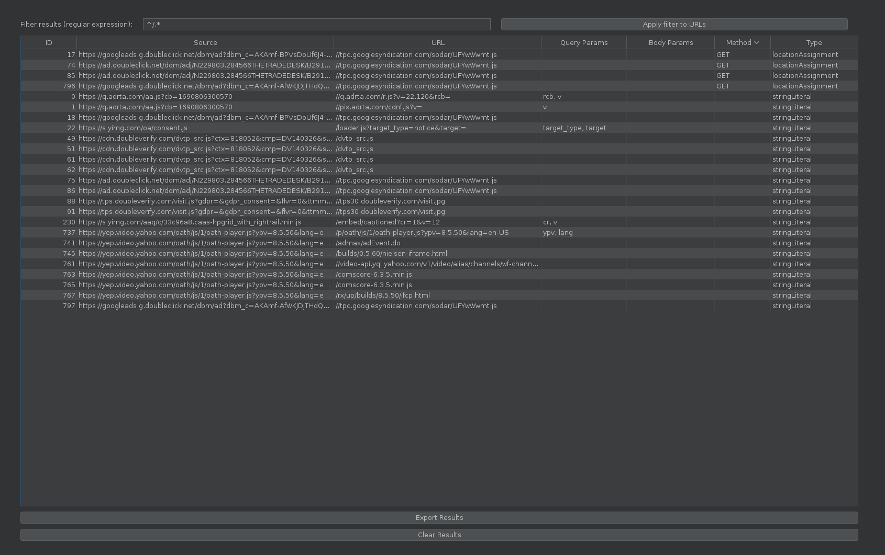

# burpjsluice
Burp Suite extension for jsluice tool by tomnomnom

https://github.com/BishopFox/jsluice

# How it works
The extension analyzes proxy responses and identifies in-scope scripts, then writes the contents to a temporary file and executes ```jsluice urls [...]```.

A thread pool is used to ensure moderate CPU usage. Findings are then displayed in a table in the BurpJsluice tab, which can be filtered via regex. All findings can be exported as CSV, copied to the clipboard, and sent to Repeater.

This has only been tested on Linux.

# Screenshot

